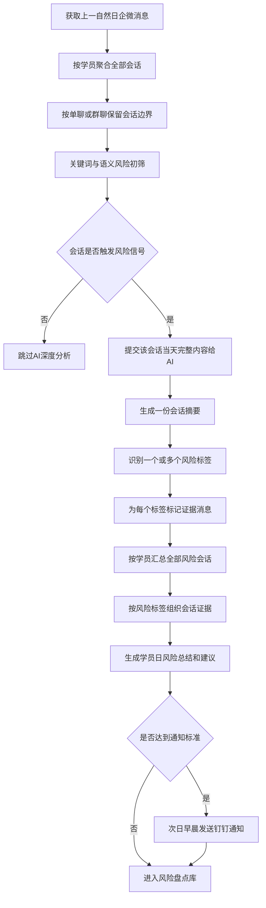
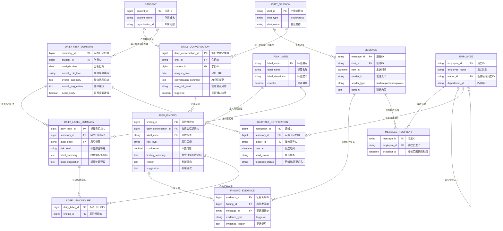
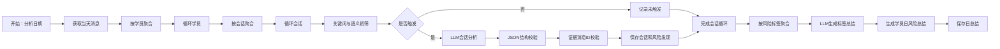
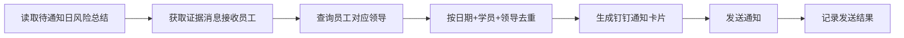

# 客户风险日总结方案

> 文档状态：讨论结论稿  
> 适用场景：企微单聊、企微群聊的客户风险识别与总结  
> 分析周期：每日一次，分析上一自然日数据  
> 时间口径：Asia/Shanghai  
> 当前范围：风险识别、证据定位、风险总结、钉钉通知、周期盘点与客诉辅助；不包含工单系统

## 1. 项目定位

本项目定位为“客户风险日总结”，不是“风险事件管理系统”。

系统每天分析学员及家长前一天在企微单聊和群聊中的沟通内容，识别潜在客诉风险，标记具体证据消息，形成学员维度的日风险总结。对于达到通知标准的高风险学员，系统在第二天早晨将风险摘要通过钉钉发送给相关消息接收员工的领导，帮助管理者及时介入。

系统核心价值包括：

1. **高风险及时通知**：前一天出现较高客诉风险时，第二天早晨通知相关领导。
2. **周期风险盘点**：支持按周、按月盘点学员风险，调整服务策略。
3. **客诉处理辅助**：实际客诉发生后，根据历史风险总结和聊天证据生成解决建议。
4. **过程可追溯**：任何AI结论均能定位到原始会话和具体消息。

当前不建设工单受理、处理、关闭和SLA等流程，也不自动判断责任人或处理人。

## 2. 核心概念

### 2.1 学员日风险总结

表示某个学员在某一天的全部聊天中暴露了哪些客户风险、风险依据是什么、建议如何处理。

业务唯一范围为：

```text
学员 + 分析日期
```

原则上，一个学员一天最多生成一份日风险总结。

### 2.2 每日会话

表示某个学员在某一天、某个单聊或群聊中的完整聊天内容。

业务粒度为：

```text
studentId + analysisDate + conversationId
```

不同会话保持独立，不将单聊和群聊直接拼接。一个会话当天无论命中多少关键词、语义规则或风险标签，都只进行一次AI会话分析。

### 2.3 风险发现

风险发现表示：

```text
一个每日会话 × 一个风险标签
```

例如，会话A同时命中“退费风险”和“换老师风险”，则产生两个风险发现，但会话A及其完整聊天内容只保存一次。

### 2.4 风险标签

风险标签是扁平、受控的分类枚举，例如：

- 退费风险
- 换老师风险
- 教师服务不满
- 投诉升级风险
- 学习意愿下降或流失风险

不设置主标签、次标签等复杂层级。若标签含义存在明显重叠，应在标签配置阶段调整定义，而不是在运行时增加多层映射。

### 2.5 证据消息

证据消息是AI判断某个风险标签时引用的具体原始消息。每条证据必须保留稳定的消息ID，并可回到完整会话中查看上下文。

同一条消息可以同时支持多个风险标签。

### 2.6 消息接收员工

消息接收员工只表示风险消息产生时处于消息接收范围内的内部员工，不代表责任人、处理人、已读人或问题造成者。

- 单聊：与学员或家长对话的员工。
- 群聊：风险消息发送时群内的全部内部员工。
- 学员向员工A吐槽员工B：员工A是消息接收员工；员工B可作为被提及员工单独记录，但不能据此认定员工B负责，也不作为消息接收员工。

## 3. 总体业务流程



## 4. 每日分析流程

### 4.1 数据获取

每天定时获取上一自然日 `00:00:00—23:59:59` 的企微聊天消息，统一使用 Asia/Shanghai 时区。

输入消息至少包含：

| 字段 | 说明 |
|---|---|
| messageId | 稳定且唯一的消息ID |
| conversationId | 单聊或群聊ID |
| conversationType | single / group |
| sentAt | 消息发送时间 |
| senderId | 发送人ID |
| senderName | 发送人姓名 |
| senderRole | student / parent / employee |
| contentType | text / image / voice / file等 |
| content | 可供分析的消息文本 |
| studentId | 归属学员ID |

语音、图片等非文本消息如已具备转写或OCR结果，应将转写文本一并用于分析，并保留原始消息ID。

### 4.2 学员和会话聚合

1. 先按 `studentId` 聚合该学员当天的全部聊天。
2. 再按 `conversationId` 拆分为独立每日会话。
3. 每个会话内按照 `sentAt` 升序排列。
4. 单聊和群聊分别保存，不跨会话拼接上下文。

跨越零点的上下文默认不纳入当天分析。这是“一天一总结”的产品边界，而不是自动合并成跨天风险事件。

### 4.3 关键词和语义初筛

对每个每日会话执行两类检测：

- **关键词检测**：识别退费、投诉、换老师等明确表达。
- **语义检测**：识别没有出现敏感词但表达了明显不满、流失或升级倾向的内容。

任一检测命中，即认为该会话需要进入AI深度分析。

需要保存初筛信息：

- `triggerMessageIds`：触发初筛的消息ID。
- `triggerType`：keyword / semantic。
- `triggerRuleCodes`：命中的规则编码。
- `triggerReasons`：触发原因。

初筛消息只用于说明系统为什么召回该会话，不等同于最终AI确认的风险证据。

### 4.4 上下文召回

会话触发后，直接召回该会话当天的完整消息，不截取关键词上下50条，也不重复切分风险片段。

这样可以避免：

- 关键前因或后续回复被截断。
- 同一个会话因为多次命中而反复分析。
- 多个风险片段被重复归类和存储。

如果单个会话当天内容超过模型上下文限制，才按时间顺序分段分析，并在分段结果之后执行一次会话级合并。该分段仅为技术降级方案，不改变业务上的“一个每日会话”概念。

### 4.5 AI会话分析

AI每次只分析一个每日会话，并输出一份会话摘要和零到多个风险发现。

建议输出结构：

```json
{
  "conversationSummary": "家长对教师响应速度和教学效果不满，提出换老师，并表示无法解决将申请退费。",
  "maxRiskLevel": "high",
  "findings": [
    {
      "labelCode": "REFUND_RISK",
      "riskLevel": "high",
      "confidence": 0.94,
      "evidenceMessageIds": ["m18", "m23"],
      "reason": "家长明确表示无法解决将申请退费。",
      "suggestion": "由管理者尽快了解诉求并给出明确解决时间。"
    },
    {
      "labelCode": "CHANGE_TEACHER_RISK",
      "riskLevel": "medium",
      "confidence": 0.89,
      "evidenceMessageIds": ["m12", "m18"],
      "reason": "家长明确提出希望更换授课老师。",
      "suggestion": "核实不满原因并评估更换老师的可行性。"
    }
  ]
}
```

AI不得凭空补充消息中不存在的事实。事实、推断和建议必须在输出中保持区分。

### 4.6 结果校验

在保存AI结果前执行以下校验：

1. 标签编码必须来自启用中的风险标签枚举。
2. 证据消息ID必须存在于本次输入的每日会话中。
3. 证据消息归属的学员、会话和日期必须一致。
4. 每个风险发现至少包含一条有效证据。
5. 无有效证据或置信度低于配置阈值的标签不得进入正式风险总结，可进入待复核数据。
6. 对AI返回的重复标签进行合并，保留证据消息并集。

## 5. 多标签与跨会话聚合规则

### 5.1 多标签处理

一个会话可以命中多个风险标签，不拆成多个独立风险事件。

例如：

| 会话 | 风险标签 |
|---|---|
| 会话A | 退费风险、换老师风险 |
| 会话B | 退费风险、教师服务不满 |

按标签形成逻辑视图：

| 风险标签 | 来源会话 |
|---|---|
| 退费风险 | 会话A、会话B |
| 换老师风险 | 会话A |
| 教师服务不满 | 会话B |

会话A只保存和总结一次。不同标签只是引用会话A中各自对应的风险发现和证据消息，不复制完整会话。

### 5.2 相同标签跨会话处理

同一学员当天在不同会话中出现相同标签时：

- 底层会话证据继续分别保存。
- 标签展示层将相同标签归在一起。
- AI基于该标签下的全部风险发现，生成一份标签日总结和建议。
- 来源会话、发生时间、接收员工和证据消息保持可追溯。

### 5.3 统计口径

必须区分以下指标：

| 指标 | 示例结果 |
|---|---:|
| 风险会话数 | 2 |
| 风险标签种类数 | 3 |
| 风险标签命中数 | 4 |
| 学员日风险总结数 | 1 |

同一会话命中三个标签，应理解为“一个风险会话、三个标签命中”，不能理解为三次独立客诉。

标签风险分数不直接相加。会话整体风险通常取所有标签中的最高等级；学员日整体风险以最高标签等级为基础，再结合重复表达、跨会话表达、明确行动意图等因素综合判断。

## 6. 学员日风险总结

一个学员每天最多形成一份日风险总结，内容包括：

- 学员基本信息。
- 分析日期。
- 当天整体风险等级。
- 整体风险摘要。
- 风险标签列表。
- 每个标签的综合总结、等级和建议。
- 每个标签对应的来源会话。
- 每个风险发现对应的具体证据消息。
- 风险消息的接收员工。
- 被提及员工（如能可靠识别，仅作客观记录）。
- 是否达到钉钉通知条件。

推荐的查看层级为：

```text
学员日风险总结
  └── 风险标签
      └── 来源会话
          └── 风险发现
              └── 具体证据消息
                  └── 展开前后消息或当天完整会话
```

老师或质检人员进入详情后，默认先看到摘要和被标记的证据消息。点击证据消息可以定位原文，并展开前后3—5条消息；必要时再查看当天完整会话。

## 7. 员工和群聊处理规则

### 7.1 单聊

单聊中的内部员工为消息接收员工。

### 7.2 群聊

群聊风险消息产生时，群内全部内部员工均记录为消息接收员工。建议保存消息发生时的群成员快照，避免后续退群或进群改变历史判断。

### 7.3 接收员工与被提及员工

如学员在与员工A的会话中吐槽员工B：

- 员工A：消息接收员工。
- 员工B：被提及员工。
- 系统不自动判断A或B是责任人、处理人或问题造成者。

### 7.4 标签维度的接收范围

某个风险标签涉及多个风险发现时，该标签的接收员工范围取相关证据消息接收员工的并集。并集只用于信息触达和查询，不用于责任归属。

## 8. 钉钉通知方案

### 8.1 通知时机

系统每天完成上一日分析后，在第二天早晨发送通知。

第一期默认对高风险学员发送通知；中风险是否通知作为可配置规则。通知规则可以结合：

- 整体风险等级。
- 特定高优先级标签。
- 明确投诉、退费或外部曝光意图。
- 同一风险在多个会话中重复出现。
- 风险连续多日出现或明显升级。

### 8.2 通知对象

通知对象为消息接收员工对应的领导，不推断业务责任人。

去重规则：

```text
分析日期 + 学员 + 接收领导 = 一条钉钉通知
```

若多个消息接收员工属于同一领导，该领导只收到一条合并通知。如果同一学员涉及多个风险标签，也合并在同一张通知卡片中。

### 8.3 通知内容

钉钉通知建议包含：

- 学员姓名。
- 整体风险等级。
- 风险标签列表。
- 简要风险总结。
- 一至两条关键证据摘要。
- 涉及的消息接收员工。
- AI建议。
- 查看完整风险详情的系统链接。

为减少敏感信息扩散，钉钉中不展示大段原始聊天内容。

可以提供“已知晓”“需要介入”等轻量反馈，但该反馈不产生工单，也不进入工单生命周期。

## 9. 周期盘点与客诉辅助

### 9.1 周度和月度盘点

基于日风险总结进行周期聚合，支持查看：

- 高风险学员清单。
- 重复出现风险的学员。
- 风险标签分布。
- 风险首次出现时间。
- 风险等级变化趋势。
- 来源会话数量。
- 涉及的消息接收员工。
- 持续升级或尚未缓解的风险。

周度盘点侧重具体学员及短期干预，月度盘点侧重风险类型、团队趋势和服务策略调整。

跨天数据只用于趋势查看，不自动合并成具有受理、处理、关闭状态的风险事件。

### 9.2 客诉发生后的处理辅助

当学员实际发生客诉后，可调取该学员历史日风险总结和原始证据，生成：

- 风险首次出现时间。
- 风险演变时间线。
- 客户明确表达的核心诉求。
- 历史沟通和已有承诺。
- 尚未解决的矛盾点。
- 推荐沟通方案。
- 可选解决办法。
- 沟通注意事项。

生成内容必须区分：

- **事实**：聊天中明确出现的内容。
- **AI推断**：根据聊天内容得出的判断。
- **AI建议**：推荐的处理动作。

## 10. 数据关系ER图



### 10.1 核心数据关系

```text
一名学员
  └── 每天一份风险总结
      ├── 多个风险标签日汇总
      │   └── 引用多个风险发现
      └── 多个每日会话
          ├── 一份会话摘要
          ├── 多个风险发现
          │   └── 多条证据消息
          └── 当天完整聊天消息
```

### 10.2 推荐唯一约束

| 数据对象 | 唯一约束 |
|---|---|
| 学员日风险总结 | `student_id + analysis_date` |
| 每日会话 | `student_id + analysis_date + chat_id` |
| 风险发现 | `daily_conversation_id + label_code` |
| 标签日汇总 | `summary_id + label_code` |
| 证据关联 | `finding_id + message_id` |
| 消息接收员工 | `message_id + employee_id` |
| 钉钉通知 | `summary_id + leader_id` |

## 11. Coze工作流编排建议

建议将每日分析和钉钉通知解耦，避免单个工作流过长，也便于失败重试。

### 11.1 工作流A：每日风险分析



工作流入参建议：

| 参数 | 说明 |
|---|---|
| analysisDate | 分析日期，默认上一自然日 |
| timezone | 固定Asia/Shanghai |
| labelConfigVersion | 风险标签配置版本 |
| keywordRuleVersion | 关键词规则版本 |
| semanticThreshold | 语义初筛阈值 |
| findingConfidenceThreshold | 风险发现最低置信度 |

### 11.2 工作流B：钉钉通知



分析结果保存成功后再进入通知流程。通知失败可以单独重试，不重新执行AI分析。

## 12. 异常与边界处理

| 场景 | 处理方式 |
|---|---|
| 同一会话命中多个关键词 | 会话只分析一次，合并触发消息ID |
| 同一会话命中多个风险标签 | 生成多个风险发现，共用同一会话 |
| 同一消息支持多个标签 | 分别建立证据关联，不复制消息 |
| 同一标签出现在多个会话 | 生成一个标签日汇总，保留多个来源会话 |
| 会话超过模型长度 | 按时间分段，之后合并为一个会话结果 |
| AI返回不存在的消息ID | 丢弃该证据；无有效证据则不保存该风险发现 |
| 群成员后续发生变化 | 使用消息产生时的成员快照 |
| 找不到员工领导 | 记录异常并进入待处理通知队列，不随意推断 |
| 多名员工对应同一领导 | 同一学员同一天只通知一次 |
| 跨零点持续对话 | 分别进入各自自然日总结，不自动合并事件 |
| 当天没有风险会话 | 不生成正式风险总结，或记录为无风险分析结果 |

## 13. 一期建设范围

### 13.1 一期包含

- 企微单聊和群聊消息接入。
- 按学员、日期和会话聚合。
- 关键词与语义初筛。
- 每日完整会话AI分析。
- 多风险标签识别。
- 具体证据消息标记。
- 会话摘要、标签日总结和学员日风险总结。
- 风险详情查看与消息定位。
- 消息接收员工识别。
- 高风险钉钉通知及发送记录。
- 基础的日风险查询和筛选。

### 13.2 一期及二期均不包含

- 自动或手动创建处理工单。
- 工单受理、分配、处理、关闭和SLA。
- 自动判断责任人或处理人。
- 员工责任或过错归因。
- 风险事件状态和生命周期。
- 跨天风险事件自动去重或合并。
- 主标签、次标签等多层标签体系。
- 关键词上下50条的片段截取方案。

### 13.3 后续可增强但仍不引入工单

- 周度和月度风险盘点。
- 学员风险变化趋势。
- 重复风险和升级风险识别。
- 实际客诉发生后的历史风险回溯。
- AI客诉解决方案辅助。
- 钉钉通知的“已知晓”“需要介入”轻量反馈。

## 14. 一期验收口径

### 14.1 流程正确性

- 系统能够按学员、日期和会话正确聚合消息。
- 同一每日会话无论命中多少规则，都只执行一次AI会话分析。
- 未通过初筛的会话不进入AI深度分析。
- 通过初筛的会话使用当天完整内容分析。

### 14.2 标签和证据正确性

- 一个会话可以返回多个风险标签。
- 同一会话不会因多标签而复制存储。
- 每个正式风险发现至少关联一条有效原始消息。
- 用户能够从风险标签定位到来源会话和具体证据消息。
- 同一证据消息可以被多个风险标签引用。

### 14.3 汇总正确性

- 一个学员一天最多一份日风险总结。
- 相同标签在多个会话中出现时，只生成一份标签日汇总。
- 标签日汇总保留全部来源会话和证据关系。
- 风险会话数、标签种类数和标签命中数分别统计。

### 14.4 通知正确性

- 高风险总结能够在次日早晨进入钉钉通知流程。
- 通知对象来自消息接收员工的领导关系。
- 同一日期、同一学员、同一领导只收到一条通知。
- 通知失败可独立重试，不重新执行AI分析。
- 系统保留通知对象、发送时间和发送状态记录。

## 15. 最终方案摘要

```text
每天获取上一日企微聊天
  → 按学员聚合
  → 按单聊/群聊形成每日会话
  → 关键词与语义初筛
  → 对触发会话分析当天完整内容
  → 每个会话生成一份摘要和多个风险发现
  → 每个风险发现标记具体证据消息
  → 相同风险标签跨会话形成标签日汇总
  → 每个学员每天形成一份风险总结
  → 高风险总结次日通知消息接收员工的领导
  → 周/月盘点和客诉发生后复用历史总结与证据
```

这套方案的核心是“会话只保存和分析一次，风险标签引用会话中的风险发现，风险发现引用具体消息”。它兼顾了多标签识别、跨会话总结、证据追溯和通知触达，同时避免引入复杂的风险事件和工单生命周期。
